# Three rescue arrangements after the failed re-cut

**Preparatory decision memo, not a gate pass.** Retain the 900 N diagnostic baseline. Prefer **A, parallel hauling beside an inclined exit**, for a future grey-box review; B offers a contrasting coordination problem, while C carries greater control risk. No force profile, new input, implementation, additional experiment run or Phase 3 work is selected here.

## The criterion conflict

The matrix retained a three-player static-helper recovery (row 38, 2.400 s), six-player recovery with all remote helpers continuously braced (row 204, 2.183 s), and a completely idle four-player casualty recovery (row 103, 2.800 s). These cases meet contact/rope bounds; that does not certify their energy accounting. [Decision and evidence](../../reports/rescue-recut-decision.md).

A disconnected limp body is not an active participant. But if its physical state and zero-input sequence are recoverable, an identical connected casualty can also recover. Connection-independent physics cannot distinguish them. Extra helpers can also supply useful but redundant force or static support: one casualty's weight does not grow with team size. Freezing a helper tests its action changes, not removal of its body or support.

These proposals seek **a useful physical action available to every connected player during the incident**, rather than necessary action changes from everyone. That differs from the user's universal static-role criterion. The existing criterion remains in force: a successful whole-episode static role still fails. Adopting the opportunity-based criterion would require an explicit later user decision; this memo does not silently make that change.

## Comparison

| Arrangement | Physical feasibility | Legible consequences | Pacing and likely experience |
|---|---|---|---|
| **A. Parallel haul / inclined exit** | Crew and casualty follow parallel routes. The incline reduces lift demand and allows towing a limp body. Most straightforward geometry, but sloped contacts are not implemented. | Advancing tightens the rope and helps ascent; sideways pulling or crowding visibly obstructs the exit. | Real travel adds duration, but current scripted rescues take 2–5 s. Shared shuffling could be funny; a trivial long tow could become a chore. |
| **B. Lower / traverse / recover** | Helpers step toward the lip to release existing routed length, then move along the bank toward a reachable opening. No reeling. | Stepping in lowers; stepping away arrests. Lateral movement changes the hanging body's route. | The physical sequence could support 10–20 s, but hesitation may exceed it. A recoverable mistaken drop could be comic; opaque wall controls and snags would be frustrating. |
| **C. Counterweight slope** | Downhill helpers supply real gravitational work through the rope. Limp-body recovery remains possible; overshoot and arrest are substantial risks. | Descending helpers and a rising casualty expose the work transfer. Late braking visibly moves bodies. | May be much too fast. A controllable group skid could be funny; an unstoppable team slide would feel punitive. Do not force timed brace cycles to lengthen it. |

All timing and comedy judgments are hypotheses. Geometry cannot validate the baseline's self-climbing wall motor or the matrix's severe energy corrections; those mechanical limits must be resolved independently before judging a new fixture.

## Diagram and fixtures

Observer diagrams show rope/work routes, not player classes or UI instructions. Lowering and counterweight hauling are outcomes of **move + brace**, not new buttons.

```mermaid
flowchart TB
  subgraph A["A — parallel routes"]
    A1["Crew advances along safe bank"] ---|"ordered rope"| A2["Body follows inclined exit"]
    A2 --> A3["Clear rim"]
  end
  subgraph B["B — release and redirect"]
    B1["Crew steps toward lip"] --- B2["Body lowers to reachable opening"]
    B2 --> B3["Traverse together, then use inclined exit"]
  end
  subgraph C["C — gravitational work"]
    C1["Crew descends slope / braces"] ---|"one rounded lip"| C2["Body rises toward exit"]
    C2 --> C3["Change line to clear rim"]
  end
```

Shared specification: preserve 80 kg bodies, fixed 3.6 m adjacent spans and 2–6-player ordering. Start from the existing 1.6 m rescue spacing, not the failed 3.2 m fixture. Use one visible rounded lip and no required multiple wraps. Validate **routed length**, swept clearance and contact/energy bounds throughout; a valid initial chord is insufficient. Inclined surfaces require work beyond the current axis-aligned contact implementation. The dimensions below are provisional fixture specifications, not root-tuning changes.

**A — inclined exit.** A 2 m rise at 10° needs approximately 11.3 m horizontal run. Provide a parallel safe-bank corridor, exit width of at least two body widths (1.1 m), and lip radius of at least one body width (0.55 m). Gravity along that incline is about 136 N; adding 0.08 sliding friction gives approximately 198 N before other losses. That only narrowly fits the nominal 240 N ice walking budget, so it is not an ice guarantee. The casualty walks/braces on support or is towed limp. Near helpers advance the line and clear the exit. Remote helpers can take up slack, improve footing, or release backward restraint on their neighbor.

**B — lower opening.** Put the opening within actual available payout: shortening the helper-to-lip path by 0.4 m releases at most approximately 0.4 m of vertical descent, not metres of hidden rope. Follow it with a 6 m lateral corridor and an inclined exit. The casualty may steer on contact; a limp body must be guidable by rope and terrain. Near helpers regulate descent and traverse. Remote helpers can approach their neighbor to remove restraint, then realign the line. Material cannot pass across a harness: only the nearest helper releases length on the casualty's span.

**C — downhill lane.** Place a finite snow slope away from the lip, ending in a flat arrest area, with the same inclined exit. An 80 kg helper descending 1 m releases approximately 785 J; lifting an 80 kg casualty 1 m needs at least that work, before losses. Multiple moving bodies add actual work, never a team-size multiplier. Any connected helper can descend, arrest the skid, or change the line for clearance; the casualty may assist but need not. Validate the complete descent/exit route against the fixed span lengths. Enough work or support from others may still make one helper's movement unnecessary.

## Reject shortcuts; preserve the stop

- A useful opportunity must change actual support transfer, a neighbor's freedom to move, or exit geometry **during** the incident. Permanently unloaded tails would falsify the opportunity claim too. These proposals do not establish coverage of every seat.
- Keep the existing rim-clearance/stability endpoint. Do not wait for everyone to touch a marker or count post-recovery travel to reach 10–20 s. If an intermediate ledge is agreed to end the rescue, report subsequent travel separately.
- Reject another wall-cap-only fix or wider stance claim: existing counterexamples already defeat them. Do not use stamina, anchor decay, arbitrary extra collapses, connection-sensitive forces or mandatory key changes to manufacture participation.
- Show tightening lines, skids and blocked exits; do not assign a culprit score. Human comprehension and comedy remain unmeasured.

A later bounded review should include held-helper and idle-casualty controls, team sizes and casualty rotations, snow/ice, mechanical bounds and human observation. Faster recovery when someone acts demonstrates benefit, not universal necessity. Until the user resolves the criterion conflict and the mechanical/human checks pass, all three arrangements remain proposals behind the Phase 2 stop.
